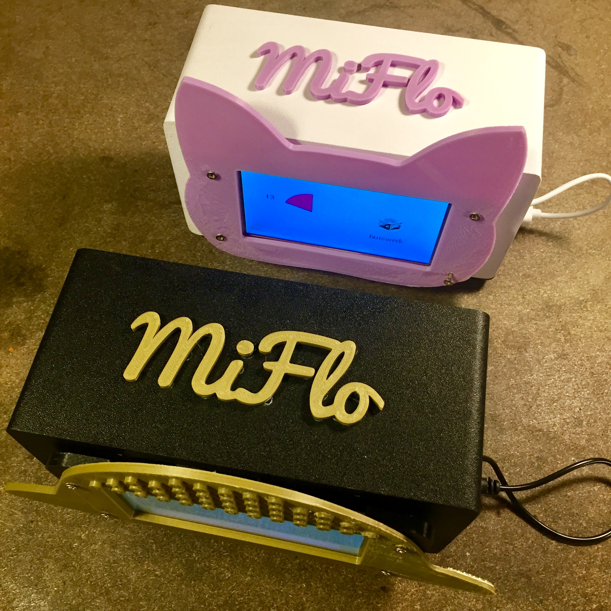
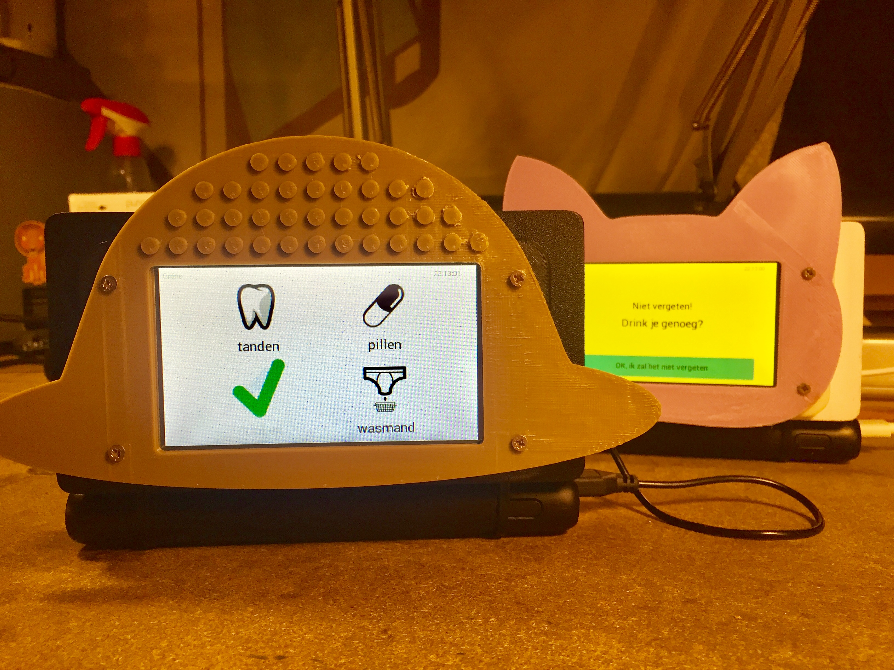

# Team Scheire MiFlo's voor Minne en Flo

Met hun MiFlo kregen Minne en Flo hun eigen persoonlijke digitale assistent. De MiFlo is een wekker die aan het internet hangt. Mama en papa kunnen via chat of hun online kalender todo's, herinneringen, wekkers of time-timers klaarzetten voor de kinderen. Door opdrachtjes uit te voeren krijgen de kinderen punten en "gamifyen" we hun dagdagelijkse schema.

Deze repository bevat alle onderdelen die je nodig hebt om zelf een MiFlo te bouwen. Een beetje handigheid met Arduino's en elektronische componenten is wel gewenst als je zelf een kopietje wil maken.

* Onder `hardware` kan je een BOM vinden van de materialen die gebruikt werden. Het bevat ook het PCB design en de files om de 3D prints te maken.
* Onder `arduino` kan je de code vinden die op de MiFlo's draait. 
* Onder `assets` vind je de iconen en geluiden die op de SD kaart van de MiFlo staan.
* Onder `backend` vind je de code die de MiFlo's vanuit het internet aanstuurt. Je kan met Telegram opdrachten naar de MiFlo sturen. Of je kan in Google calendar opdrachten klaarzetten die dan elke 5 minuten worden opgehaald en doorgegeven worden aan de MiFlo's.